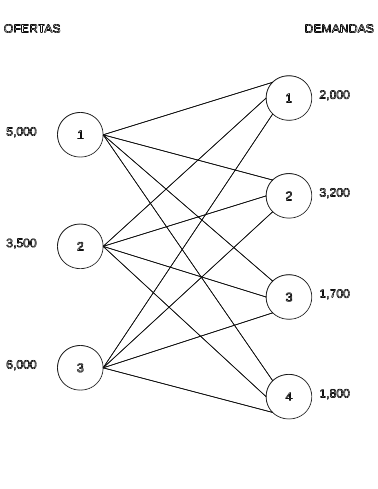

## Introducción

Veamos otro ejemplo de problema del tipo _producción_. Sigue siendo un caso en el cual se tiene que encontrar la combinación de productos elaborados con recursos limitados que aumentan las utilidades para nuestra organización.

## Problema de mezcla de productos

Una compañía mueblera fabrica pupitres, sillas y mesas, para las cuales ha establecido que aportan una contribución a las utilidades de $\$5,000$, $\$6,000$ y $\$3,000$ por unidad, respectivamente. Para la producción de dichos artículos se cuenta con una disponibilidad semanal de 150 metros de madera, 120 metros de tubo y 200 horas-hombre de trabajo. Plantee el modelo matemático de programación lineal si sabe que para producir un pupitre necesita 5 metros de madera, 3 de tubo y 4 horas; para la silla requiere 3 metros de madera, 4 de tubo y 5 horas; y para la mesa se utilizan 2 metros de madera, 3 de tubo y una hora de trabajo.

### Solución
Debemos organizar la información de manera que resulte más clara. Para ello, generemos una tabla con la misma:

Recurso | Pupitres | Sillas | Mesas | Disponibilidad
:-------| :-------:|:------:|:-----:|:-------------:
Madera  |5m|3m|2m|150 metros
Tubo    |3m|4m|3m|120 metros
Horas-Hombre|4h|5h|1h|200 horas
Utilidad/unidad|$\$5,000$|$\$6,000$|$\$3,000$
Variables|$x_1$|$x_2$|$x_3$

Cada producto es una variable. Así que cada una representa la cantidad de unidades a producir por semana.

La función objetivo representará el deseo de la empresa de maximizar sus ganancias, así que quedará de la siguiente manera:

$$
max: Z=5000x_1+6000x_2+3000x_3
$$

Las limitaciones de los recursos deben representarse con restricciones, con una por cada materia prima:
$$
5x_1+3x_2+2x_3 \leq 150 \ metros\ de \ madera \\
3x_1+4x_2+3x_3 \leq 120 \ metros\ de\ tubo \\
4x_1+5x_2+x_3 \leq 200\ horas-hombre
$$
No olvidemos las restricciones de no negatividad:
$$
x_1,x_2,x_3 \geq 0
$$

Ahora bien, la mueblería acaba de imponer ciertas restricciones a la fabricación. Después de entablar comunicación con el departamento de Ventas, se ha concluído que se deberán producir un máximo de 20 pupitres y un mínimo de diez mesas. También indica que por cada tres mesas tienen que fabricarse trece sillas. ¿Cómo podría expresar la nueva política en su modelo matemático?

Las tres restricciones adicionales pueden expresarse como sigue. En el caso de la primera, basta con indicar que la variable que corresponde a los pupitres ($x_1$) no debe ser mayor a 20. Quedaría así:
$$
x_1 \leq 20
$$
La segunda debe indicar que las mesas ($x_3$) deben ser al menos 10:
$$
x_3 \geq 10
$$
La tercera es un poco más compleja, pero puede construirse con un poco de lógica. Sabemos que cada tres mesas ($3x_2$) implican trece sillas ($13x_2$). Por lo tanto, las igualamos:
$$
13x_2=3x_3
$$
Esta es una buena oportunidad para mencionar que las expresiones que contiene un problema de programación lineal deben tener solo constantes en su lado derecho, tal como todas las que habíamos formulado, a excepción, precisamente de esta última. Así que, mediante un despeje, pasamos $3x_3$ al lado izquierdo. La restricción quedaría finalmente así:
$$
13x_2-3x_3=0
$$

El modelo completo quedaría entonces así:
$$
max: Z=5000x_1+6000x_2+3000x_3 \\
\ \\
sujeto\ a:\\
5x_1+3x_2+2x_3 \leq 150  \\
3x_1+4x_2+3x_3 \leq 120  \\
4x_1+5x_2+x_3 \leq 200\\
x_1 \leq 20\\
x_3 \geq 10 \\
13x_2-3x_3=0\\
x_1,x_2,x_3 \geq 0
$$

## Problema de la mezcla dietética
Usted está cargo de una guardería, y por lo tanto, tiene que diseñar los platillos para los niños. Su nutricionista le ha informado que cada niño debe recibir diariamente un mínimo de 25 miligramos de calcio, 15mg de hierro y 24mg de vitaminas, pero no más de 30mg. Los niños son alimentados con leche cuyo valor es de $\$10$ por litro, huevos que cuestan $\$1.50$ cada uno y compotas con valor de $\$6$ por frasco. Construya el modelo de programación lineal si sabe que un litro de leche contiene 2mg de calcio, 3mg de hierro y 1mg de vitaminas; un huevo contiene 4mg de calcio, 5mg de hierro y 3mg de vitaminas; y cada frasco de compota aporta 6mg de calcio, 1mg de hierro y 2mg de vitaminas. Determine pues, cuánta cantidad de cada alimento debe preparar para cumplir los requerimientos nutricionales.

### Solución
De nuevo es muy recomendable que se organicen los datos en un formato tabular que muestre el nutriente, el contenido de éste en cada alimento y los requerimientos mínimos. También se debe incluir el costo de cada alimento.

NUTRIENTE|CONTENIDO EN LECHE|CONTENIDO EN HUEVOS|CONTENIDO EN COMPOTA|REQUERIMIENTO DIARIO
:---|:---:|:---:|:---:|:---:
Calcio|2mg|4mg|6mg|MIN 25
Hierro|3mg|5mg|1mg|MIN 15
Vitaminas|1mg|3mg|2mg|MIN 24, MAX 30
Costo|10.00|1.50|6.00

Es notorio que las variables en este caso son los alimentos, ya que son sus cantidades las que debemos modificar para conseguir satisfacer los requerimientos. Por esa razón, definimos la leche como $x_1$, los huevos como $x_2$ y la compota como $x_3$. 

En delante definimos la función objetivo, la cual debe estar relacionada con las variables y sus costos asociados:

$$
min: Z=10x_1+1.50x_2+6x_3
$$

Definimos las restricciones, las cuales deben consistir en una por cada nutriente e indicar su contenido en cada alimento y lo que se debe cubrir con la combinación de los tres alimentos en sí:

$$
2x_1+4x_2+6x_3\geq25\\
3x_1+5x_2+x_3\geq15\\
x_1+3x_2+2x_3\geq24\\
x_1+3x_2+2x_3\leq30
$$

Notemos que la tercera y cuarta restricciones se refieren al mismo nutriente (las vitaminas), se debe a que existen dos condiciones que se deben cubrir: garantizar que los niños reciban al menos 24mg pero no más de 30.

#### Modelo completo
El modelo listo queda de la siguiente manera:

$$
min: Z=10x_1+1.50x_2+6x_3\\
\ \\
sujeto\ a:\\
2x_1+4x_2+6x_3\geq25\\
3x_1+5x_2+x_3\geq15\\
x_1+3x_2+2x_3\geq24\\
x_1+3x_2+2x_3\leq30\\
x_1, x_2, x_3 \geq0
$$

## Problema de mezcla de componentes
Una siderúrgica dispone de un horno, el cual debe ser cargado con dos toneladas de materiales para elaborar una aleación especial. Dicha aleación debe contener mínimo el 15% de cobre pero no más del 20% y máximo 17% de fósforo. Para cargar el horno se cuenta con minerales de hierro, tungsteno, níquel y carbono. Mediante un estudio químico se estableció que el hierro contiene 7% de cobre y 9% de fósforo, el tungsteno contiene 11% de cobre y 3% de fósforo, el níquel 19% de cobre y el 8% de fósforo; mientras que el carbono contiene 4% de cobre y 17% de fósforo. Plantee el modelo si sabe que el material cuesta $\$1,000$ por kilogramo de hierro, $\$2,000$ la libra de tungsteno, $\$3,000$ el níquel por kilogramo y $\$1,700$ la libra de carbono.

### Solución
Comencemos elaborando la tabla, pero antes notemos que la unidad de peso utilizada en el tungsteno y el carbono es la libra: hay que transformarla a kilogramos, siendo aproximadamente igual a medio kilo. En la tabla se escribieron los costos por kilogramo.

MATERIAL|HIERRO|TUNGSTENO|NÍQUEL|CARBONO|REQUISITOS DE CALIDAD
:---|:---:|:---:|:---:|:---:|:---:
Cobre|7%|11%|19%|4%|MIN 15%, MAX 20%
Fósforo|9%|3%|8%|17%|MAX 17%
Costos/kilo|1,000|4,000|3,000|3,400

Lo que debemos definir es la cantidad de hierro, tungsteno, níquel y carbono que se debe utilizar Por lo tanto, las variables deben referirse a los kilogramos de estos:

$x_1=$ kilos de hierro a usar

$x_2=$ kilos de tungsteno

$x_3=$ kilos de níquel

$x_4=$ kilos de carbono

La función objetivo debe referirse a los costos de los materiales comprados, siendo la minimización lo que se persigue:

$$
min:Z=1,000x_1+4,000x_2+3,000x_3+3,400x_4
$$

Las restricciones deben garantizar el contenido de los materiales en las aleaciones. Por lo tanto, tomamos cobre y multiplicamos el porcentaje de contenido de cada material por los kilos, enseguida multiplicamos el porcentaje necesario como requisito de calidad por la cantidad de materia prima que se vierte al horno (dos toneladas). Lo mismo se realiza en el caso del fósforo. Las restricciones quedan entonces de la siguiente manera:

$$
min\ cobre\ 0.07x_1+0.11x_2+0.19x_3+0.04x_4\geq(2,000)(0.15)\\
max\ cobre\ 0.07x_1+0.11x_2+0.19x_3+0.04x_4\leq(2,000)(0.20)\\
max\ fósforo\ 0.09x_1+0.03x_2+0.08x_3+0.17x_4\leq(2,000)(0.17)
$$

Recordemos también que el horno debe ser cargado con las dos toneladas, por lo que agregamos la restricción que lo indique:

$$
x_1+x_2+x_3+x_4=2,000
$$

El modelo completo debe quedar de la siguiente manera:

$$
min:Z=1,000x_1+4,000x_2+3,000x_3+3,400x_4\\
\ \\
sujeto\ a:\\
0.07x_1+0.11x_2+0.19x_3+0.04x_4\geq(2,000)(0.15)\\
0.07x_1+0.11x_2+0.19x_3+0.04x_4\leq(2,000)(0.20)\\
0.09x_1+0.03x_2+0.08x_3+0.17x_4\leq(2,000)(0.17)\\
x_1+x_2+x_3+x_4=2,000\\
x_1,x_2,x_3,x_4\geq0
$$

## Problema de distribución
Una cervecera produce en tres plantas ubicadas en Zacatecas, Torreón y Guadalajara, las cuales tienen la capacidad de producir 5,000, 3,500 y 6,000 cajas por semana, respectivamente. La cerveza se vende a través de cuatro distribuidores que se encuentran ubicados en Guanajuato, Monterrey, Chihuahua y Ciudad de México, los cuales han determinado su demanda semanal en 2,000, 3,200, 1,700 y 1,800 cajas. Plantee el modelo si sabe que llevar una caja de Zacatecas a Guanajuato cuesta $\$0.90$, a Monterrey $\$7.50$, a Chihuahua $\$9.00$ y a CDMX $\$6.70$; el costo de transporte de Torreón a Guanajuato es de $\$7.80$, a Monterrey es de $\$4$, a Chihuahua es de $\$6.50$ y a CDMX es de $\$8.50$; mientras que transportar cada caja desde Guadalajara hacia Guanajuato cuesta $\$1.70$, a Monterrey $\$14.70$, a Chihuahua $\$15.00$ y a CDMX $\$6.50$.

### Solución
En este tipo de problemas se vuelve recomendable utilizar otra nomenclatura para nombrar las variables, una que nos permita identificar tanto el origen como el destino. Para ello haremos uso de dos subíndices en la variable: $x_{ij}$, donde $x$ es la cantidad de cerveza que se produce en $i$, que es el origen y se transporta a $j$, que es el destino. Nuestra planta _1_ es Zacatecas, la _2_ es Torreón y la _3_ es Guadalajara. Por otro lado, Guanajuato será el distribuidor _1_, Monterrey el _2_, Chihuahua el _3_ y la Ciudad de México el _4_. Así, por ejemplo, la cantidad de cerveza que se debe mover de Torreón a Guanajuato es $x_{21}$. Lo ideal en estos problemas es dibujar un diagrama que facilite la visualización de todas las rutas, que en este caso resultan ser 12: $(3\ orígenes)(4\ destinos)=12\ rutas$. En dicho diagrama incluiremos las capacidades (ofertas) de cada planta y las demandas de cada distribuidor. Tanto plantas como distribuidores son representados como nodos.

## Problema de asignación
El ayuntamiento de cierta ciudad está interesada en generar la manera más barata de asignar 4 proyectos a 4 contratistas diferentes. Se debe asignar de manera garantizada un proyecto a cada contratista, así que construya el modelo que permita hacerlo al costo más bajo. Los presupuestos resumidos por contratista se muestran a continuación:

Proyecto|Contratista 1|Contratista 2|Contratista 3|Contratista 4
:---|:---:|:---:|:---:|:---:
Parque|50|60|48|55
Edificio|35|30|33|39
Puente|40|43|42|41
Túnel|27|30|25|29

