Se abordarán tres métodos de solución para problemas de programación lineal. El primero es el método gráfico, el cual es bastante sencillo y fácil de implementar, con la desventaja de que solo funciona para problemas de dos variables; el segundo será el método __Símplex__, el cual tiene algunas variantes y funciona para cualquier problema, aunque resulta ser largo y por ende, proclive a errores; por último, se verá la solución mediante el programa informático _R_.

## Método Gráfico
Para mostrar en qué consiste el método gráfico, veamos una serie de ejercicios de ejemplo:

### Solución a problemas de maximización

#### Solución óptima única
El problema tendrá una solución única cuando un solo punto del área factible es la solución óptima. Ese punto óptimo debe ser un vértice del área factible.

##### Ejercicio
Una empresa fabrica bibliotecas y escritorios, con precios de venta por unidad de $\$9,000$ y $\$10,000$, respectivamente. Para efectuar la producción, la empresa cuenta con una disponibilidad mensual de 700 metros de madera, 800 metros de tubo y 900 pliegos de papel-lija. Se sabe que una biblioteca consume 7 metros de madera, 10 metros de tubo y 6 pliegos de papel-lija; mientras el escritorio necesita 10 metros de madera, 8 metros de tubo y 15 pliegos de papel-lija. ¿Cuántas bibliotecas y cuántos escritorios debe fabricar si desea el ingreso máximo?

##### Solución

Este problema puede resolverse con el método gráfico, ya que contiene solo dos variables. 

1. El primer paso es construir el modelo, lo cual ya se abordó en la unidad anterior. El modelo resultante es:

$$
max:Z=9,000x+10,000y\\
\ \\
sujeto\ a:\\
7x+10y\leq700\\
10x+8y\leq800\\
6x+15y\leq900
$$

2. El segundo paso es trazar las restricciones como las desigualdades que son. Si el proceso será a mano, entonces debemos encontrar los puntos donde cada restricción se cruza con los ejes $x$ y $y$. Comencemos con la primera: $7x+10y\leq700$. La vamos a tratar como una ecuación lineal y no como una desigualdad. Hacemos nula una de las variables y despejamos para la restante, con el propósito de encontrar el punto de cruce de la línea con el eje de la variable que hicimos cero:

$$
Para\ x=0:\\
10y=700\\
y=\frac{700}{10}\\
y=70\\
Coordenada\ de \ cruce: (0,70)
$$

Esto nos da el punto de cruce de la línea con el eje $x$: $(0,70)$. Hacemos lo mismo pero con la otra combinación restante, otra variable nula y el despeje de la que queda:

$$
Para\ y=0:\\
7x=700\\
x=\frac{700}{7}\\
x=100\\
Coordenada\ de \ cruce: (100,0)
$$
Siguiendo la misma lógica, obtenemos todos los pares de puntos que representen los cruces de las expresiones con los ejes. Se recomienda hacer esto primero para conocer el tamaño del plano cartesiano que deberemos dibujar en el paso siguiente.

Para la segunda restricción tendremos las coordenadas o puntos en $(0,100)$ y en $(80,0)$. Para la tercera, los puntos son $(0,60)$ y $(150,0)$. Con todos los puntos obtenidos, comparamos sus valores en $x$ y en $y$, para saber cuál es el mayor. Resulta ser $150$ para $x$ y $100$ para $y$. Por lo tanto, el plano debe superar un poco $150$ en el eje horizontal y $100$ en el eje vertical, partiendo siempre desde el origen -debido precisamente a que las variables solo pueden ser positivas en el resultado-.

3. Nos remitimos al par de puntos de la primera restricción. Comenzamos a trazarlos en el plano primero: $(0,70)$ y $(100,0)$:

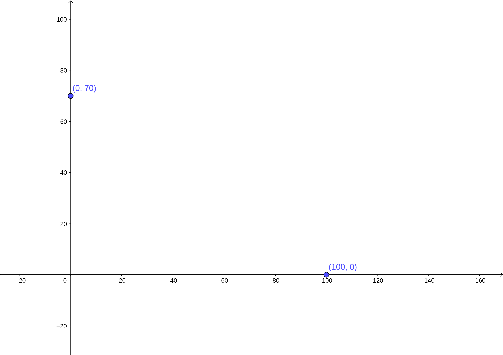

Unimos el par de puntos con una línea recta:

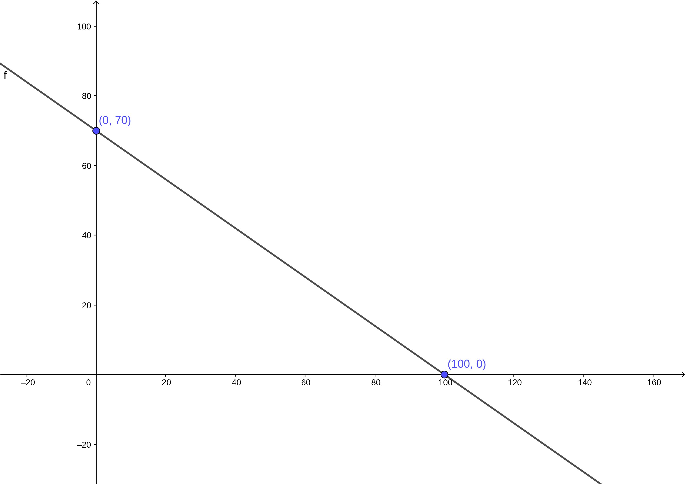

4. Ahora debemos ubicar lo que llamaremos a partir de ahora la __zona factible__, es decir, la parte delimitada por la restricción. Hay que recordar que la restricción es una desigualdad, por lo que no queda restringida solamente puntos sobre la línea. Más bien, la línea solo representa una de las fronteras, puesto que las otras limitaciones las impone el propio modelo: las restricciones de no negatividad. Para tener una idea un poco mejor, la zona factible queda delimitada por la no negatividad de las variables y la línea que representa la restricción. Como puede notarse, la desigualdad es del tipo $\leq$, así que la zona factible queda del lado de la recta más cercano al origen del plano. Por lo tanto, podemos trazarla así:

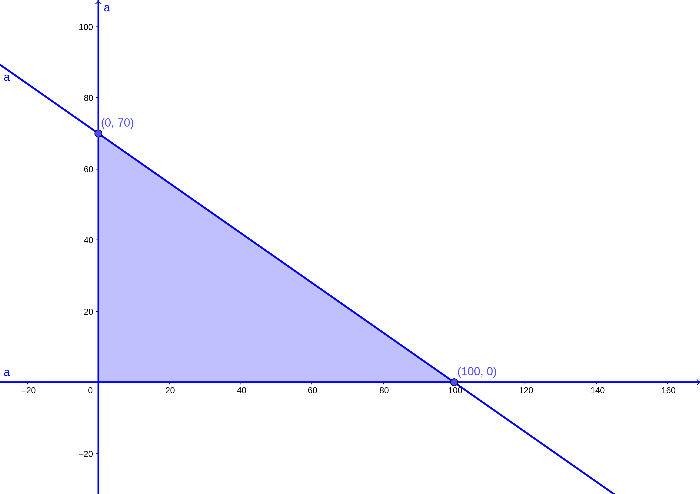

Las desigualdades a las que nos referimos las identificamos de la siguiente manera:

5. Realizamos lo mismo con el segundo par de puntos. Los trazamos:

Y los unimos:

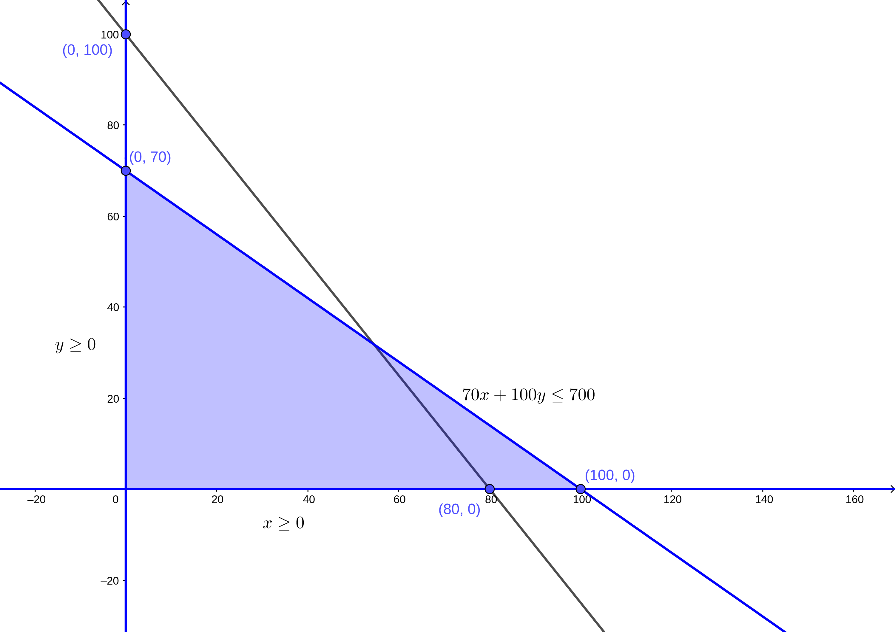

Aquí podemos notar algo muy importante. La nueva línea recta corta la zona factible y en apariencia crea otro trozo de la misma. Se debe recalcar que la zona factible solo puede ser limitada por los ejes del plano y líneas rectas, por lo que no debe ser atravesada por nada más. En este caso, el área que la nueva línea recta ha cortado se elimina de la propia zona factible. ¿Cuál área de la zona factible se eliminará? Como la nueva recta representa otra restricción del tipo $\leq$, entonces el área más lejana al origen del plano es la que se elimina de la zona factible, quedando ésta de la siguiente manera:

6. Trazamos el último par de puntos:

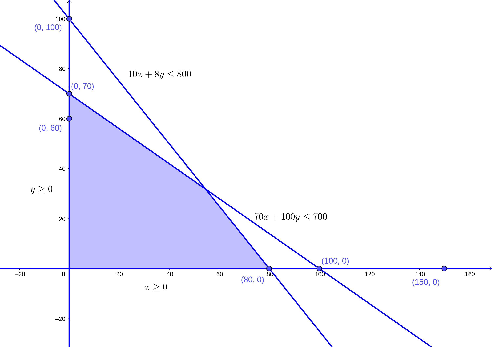

Trazamos la recta resultante:

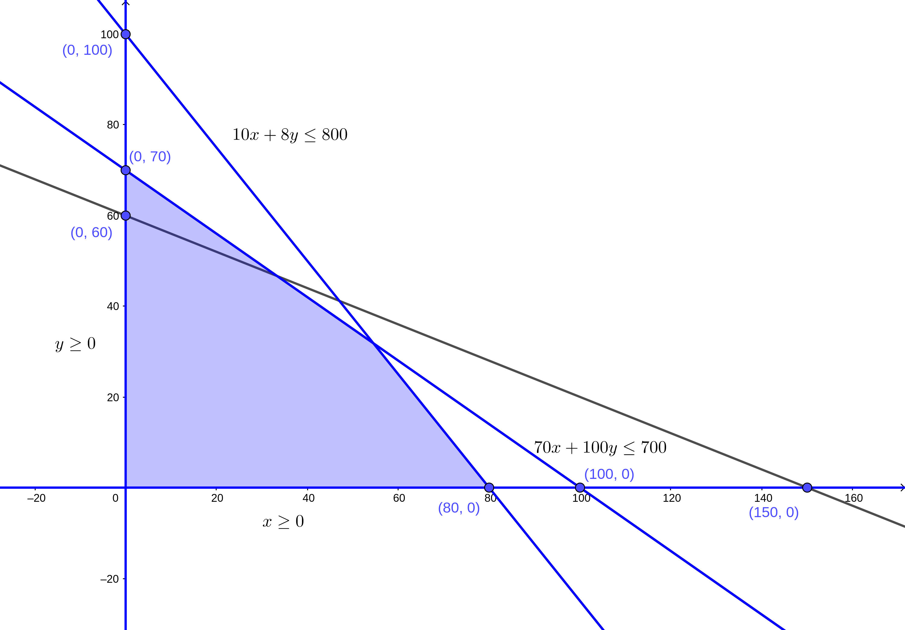

Definimos la nueva zona factible:

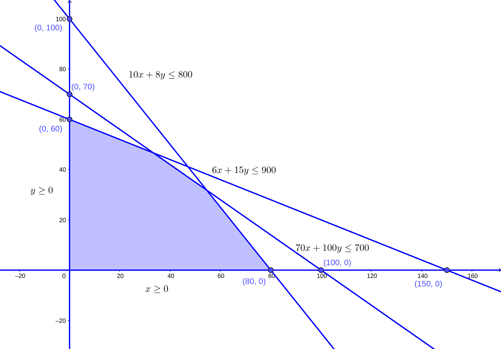

Podemos hacer un acercamiento a la zona factible:

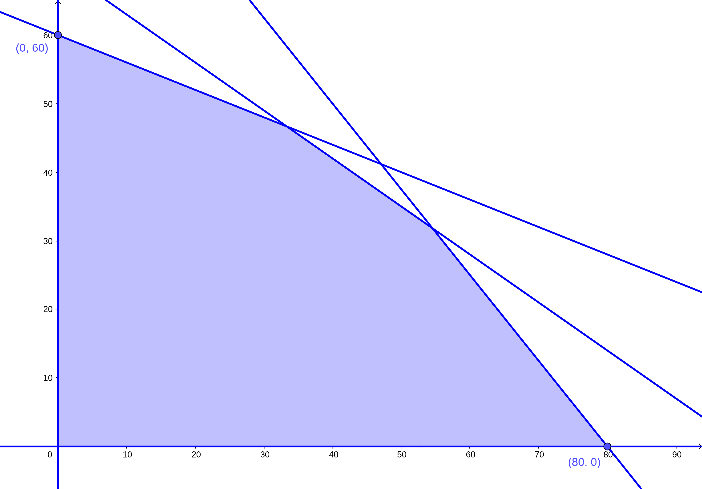

7. Ya que conocemos la forma de la zona factible, debemos ahora encontrar la solución óptima. Si bien, cualquier punto dentro de la zona factible es una solución al problema, la mejor solución es aquel punto que nos da una función objetivo máxima. Por lo general ese punto se encuentra en uno de los vértices de la zona factible. Por lo tanto, debemos graficar dichos puntos:

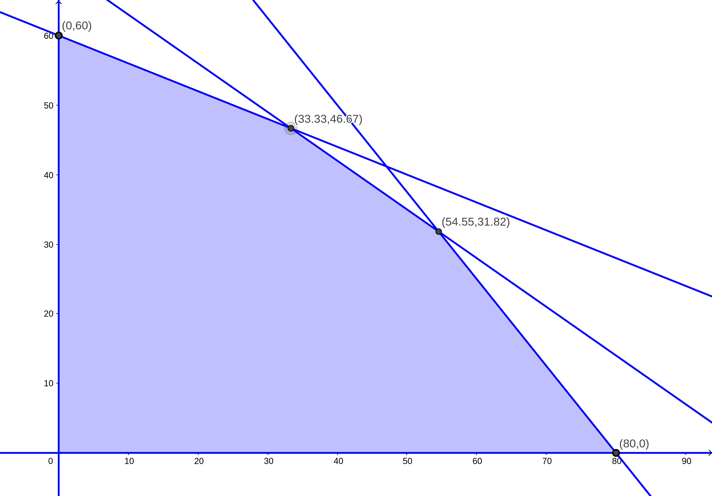

8. Es momento de involucrar la función objetivo. Tomamos las coordenadas en $x$ y $y$ de cada vértice y las sustituímos en dicha función. La solución óptima será la mayor que encontremos. Probemos con el primer vértice:

$$
Z_1=9,000(0)+10,000(60)=0+600,000
$$

Segundo vértice:

$$
Z_2=9,000(33.33)+10,000(46.67)=300,000+466,666.67=766,666.67
$$

Tercer vértice:
$$
Z_3=9,000(54.55)+10,000(31.82)=490,950+318200=809,150
$$

Cuarto vértice:

$$
Z_4=9,000(80)+10,000(0)=720,000
$$

El valor más alto resulta ser el del tercer vértice: $\$809,150$. Este punto es la solución óptima del problema.

9. La solución del problema es entonces como sigue. Ya que $x$ representa a las bibliotecas, entonces deben fabricarse 54.55 de ellas. En cuanto a los escritorios, estos son representados por $y$, por lo tanto, deben fabricarse 31.82 escritorios. Si esas cantidades se elaboran, se obtiene un ingreso total de $\$809,150.00$. 

#### Solución óptima múltiple
Una solución óptima múltiple ocurre cuando hay por lo menos dos vértices cuya sustitución en la función objetivo dan el máximo valor posible. A continuación veamos un ejercicio que lo ejemplifica.

##### Ejercicio

Usted dispone semanalmente para la producción de puertas y ventanas con 350 metros de lámina y 360 metros de ángulo. Cada puerta aporta $\$70$ a las utilidades, mientras cada ventana aporta $\$50$ por unidad. Cada puerta requiere 7 metros de lámina y 4 metros de ángulo. Cada ventana requiere 5 metros de lámina y 9 de ángulo. ¿Qué cantidad debe fabricar de cada artículo si se indica que máximo podrá vender 40 puertas?

##### Solución
Primero construiremos el modelo, cuyas variables resultan ser $x$ para la cantidad de puertas fabricadas y $y$ para la de las ventanas. La función objetivo se refiere a la maximización de las utilidades y cada restricción se refiere a un recurso específico. En este caso, se agrega una restricción que tiene que ver más con pronósticos de ventas que con lo funcional de un recurso limitado: el hecho de que solo podrá vender hasta un máximo de 40 puertas. El modelo resultante es el siguiente:

$$
max: Z=70x+50y\\
\ \\
sujeto \ a:\\
7x+5y\leq350\\
4x+9y\leq360\\
x\leq40\\
x,y\geq0
$$

El proceso para resolver el problema mediante gráficas es el mismo que en el problema anterior, con la salvedad de que se presenta una restricción univariable: $x\leq40$. Para esta restricción no es necesario encontrar sus puntos de cruce con algún eje. En realidad, se cruza solamente con el eje $x$ precisamente en el punto 40 del mismo. La zona factible que le corresponde se dirige también hacia el origen, quedando así:

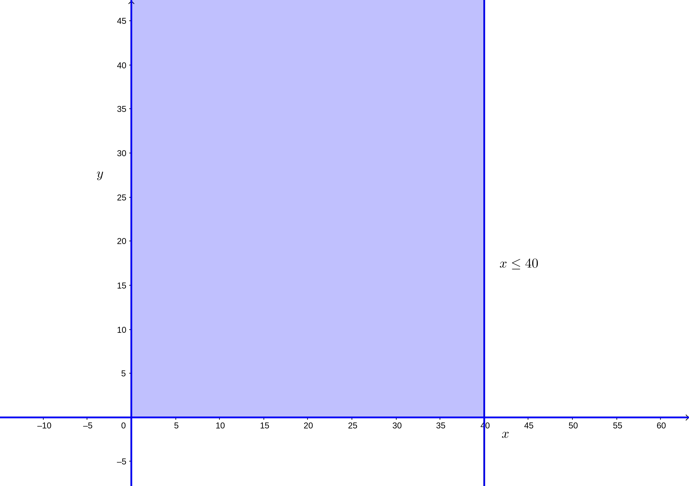

Mientras tanto, las demás restricciones las trazamos de manera similar al ejemplo anterior, quedando nuestro gráfico de la siguiente manera:

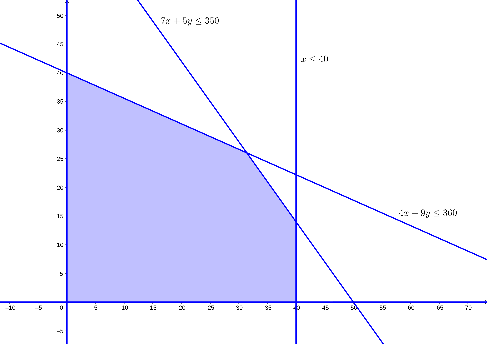

Trazamos los puntos vértice:

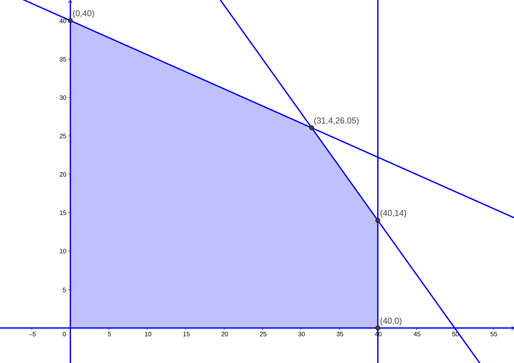

Si sustituimos todos los puntos en la función objetivo tendremos exactamente el mismo resultado tanto en el punto $(31.4,26.04)$ como en el punto $(40,14)$. Dicho resultado es de $\$3,500$ en la función objetivo. Asi que no importa cual de estas dos cantidades fabriquemos, obtendremos la mayor ganancia.

#### Solución no acotada
Una fábrica de artesanías elabora bolsos y chamarras. La venta de un bolso aporta $\$2,000$ y consume 5 horas de mano de obra; mientras la chamarra aporta $\$3,000$ y consume 9 horas. Se deben consumir al menos 450 horas de mano de obra por mes. ¿Cuántos bolsos y chamarras debe fabricar si sabe que mínimo venderá 20 chamarras y máximo 30 bolsos?

#### Sin solución
Produce baldosas y tabletas, generando utilidades por $\$5,000$ y $\$4,000$ por metro cuadrado, respectivamente. Cuenta con 200 metros cuadrados de arena y 240 metros cuadrados de cemento por semana. ¿Cuánto debe fabricar si para un metro cuadrado de baldosas requiere 4 metros cuadrados de arena y 3 de cemento; mientras que para las tabletas necesita 5 metros cuadrados de arena y 8 de cemento? Considere que tiene garantizada la venta de al menos 50 metros cuadrados de tableta.

### Solución a problemas de minimización

#### Solución única óptima

Una empresa dedicada a criar caballos ha establecido que es necesario suministrar diariamente a cada uno un mínimo de 200mg de vitamina A, un mínimo de 160mg de vitamina B y un mínimo de 150mg de vitamina C. Los animales son alimentados con matas de pasto y mineral, los cuales cuestan $\$300$ por mata y $\$500$ por libra de mineral. ¿Qué cantidad de cada alimento debe suministrarse a cada caballo diariamente? Se sabe que una mata de pasto aporta 4mg de vitamina A, 2mg de vitamina B y 5mg de vitamina C; mientras que la libra de mineral aporta 5mg de vitamina A, 8mg de vitamina B y 3mg de vitamina C.

##### Solución

En este caso el modelo es un poco diferente a los anteriores. Por principio de cuentas, se trata de minimizar costos, asi que podemos esperar que muchas restricciones sean del tipo $\leq$, aunque eso sí, no es regla que deban ser así. Podemos distinguir que tenemos dos variables, las matas de pasto que serán $x$ y el mineral que será $y$. Pasamos a modelar el caso, quedando de la siguiente manera:

$$
min:Z=300x+500y\\
\ \\
sujeto\ a:\\
Vitamina\ A:\ 4x+5y\geq200\\
Vitamina\ B:\ 2x+8y\geq160\\
Vitamina\ C:\ 5x+3y\geq150\\
x,y\geq0
$$

El método gráfico se lleva a cabo bajo la misma lógica explicada en los problemas anteriores, con la excepción de que las restricciones cuya desigualdad sea del tipo $\geq$ implican una zona factible del lado de la recta lejano al origen del plano. Por ejemplo, veamos cómo queda la línea representativa de la primera restricción:

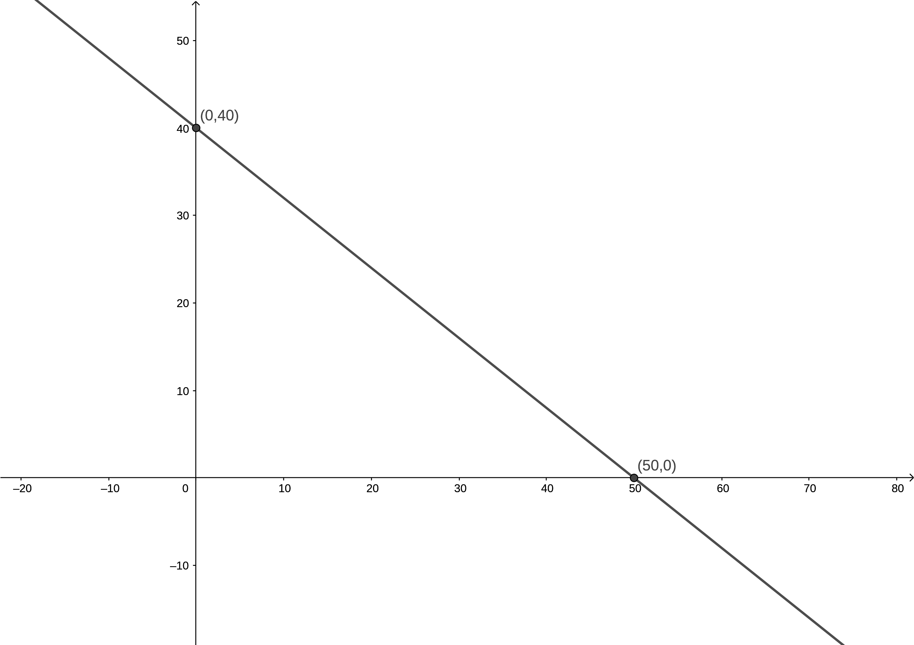

La zona factible debe quedar del lado opuesto al origen del plano, como si estuviera pues a la derecha de la línea, quedando como en la siguiente imagen:

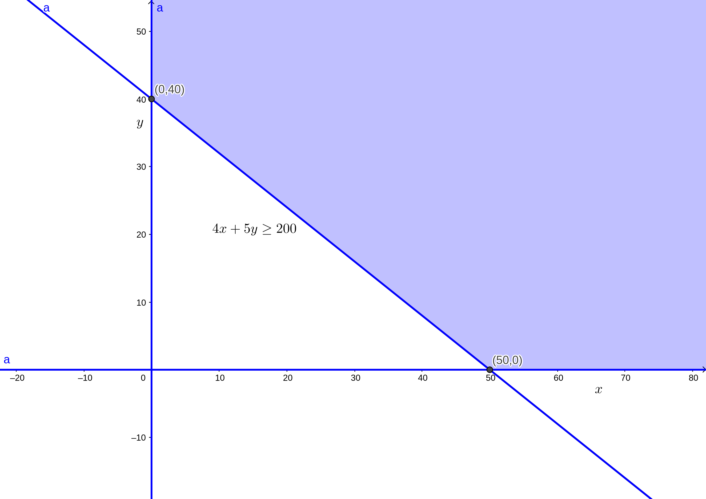

Con todo lo anterior en mente, trazamos las desigualdades y los puntos vértice posteriores. El gráfico completo quedaría así:

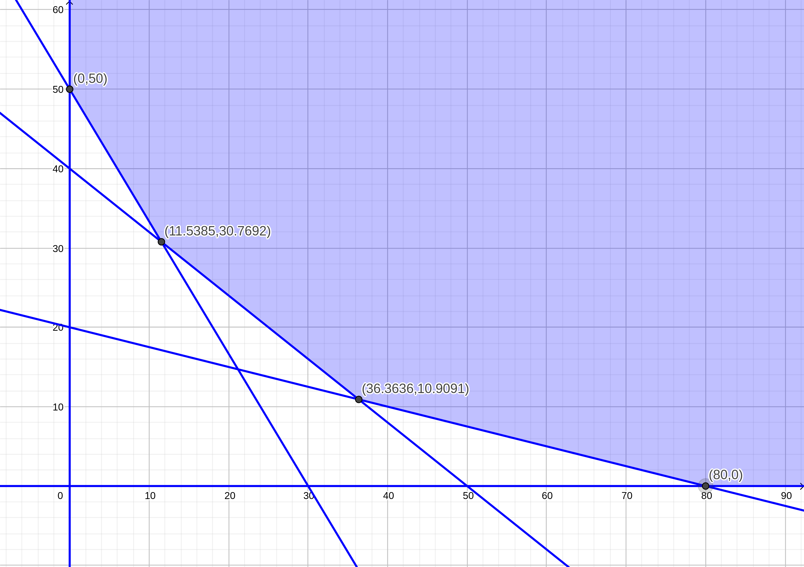

La solución se encuentra en el vértice cuyos valores en $x$ y $y$, al ser sustituidos en la función objetivo, nos den el valor mínimo. Sustituyamos los resultados:

$$
Z_1=300(0) +500(50)=0+25000=25000\\
Z_2=300(11.5385)+500(30.7692)=3461.55+15384.6=18846.15\\
Z_3=300(36.3636)+500(10.9091)=10909.08+5454.55=16363.63\\
Z_4=300(80)+500(0)=24000+0=24000
$$

Con base en estos resultados, podemos concluir que la mejor combinación de matas de pasto y mineral es aquella que nos asegura un costo mínimo de $\$16,363.63$, consistiendo ésta de 36.3636 matas de pasto y 10.9091 unidades de mineral.

#### Solución óptima múltiple

Una empresa de combustibles produce gasolina y ACPM a un costo de $\$20.00$ y $\$40.00$ respectivamente. Para producir un galón de gasolina se requieren 4 horas-hombre, 6 horas-máquina y 8 litros de petróleo. Para cada galón de ACPM son necesarias 8 horas-hombre, 5 horas-máquina y 10 litros de petróleo. Deben consumirse al menos 320 horas-hombre y 300 horas-máquina al mes. ¿Qué cantidad debe producirse si se cuenta con 800 litros mensuales de petróleo?

#### Solución no acotada

La industria siderúrgica un tipo de aleación especial compuesta por sílice y aluminio; los cuales compra a $\$30.00$ y $\$50.00$ por kilogramo, respectivamente. La utilización de un kilogramo de sílice requiere el consumo de 5 miligramos de material radioactivo y dos litros de agua; por otro lado, producir un kilogramo de aluminio requiere consumir 4 miligramos de material radioactivo y produce 3 litros de agua. Por políticas de la empresa, deben consumirse al menos 20 miligramos de material radioactivo y se cuenta con 6 litros de agua. ¿Qué cantidad de sílice y aluminio se debe utilizar si se sabe que como máximo deben utilizarse 8 kilogramos de sílice y que el gobierno subsidia con $\$150.00$ la utilización de cada kilogramo de aluminio?

#### Problema sin solución

Una empresa zapatera ha establecido que venderá como máximo 30 pares y como mínimo 40 pares de tenis. Para la producción de estos artículos se cuenta con una disponibilidad de mensual de 180 metros de cuero se ha establecido que el costo de producción de cada par de zapatos es de $\$500.00$ y de cada par de tenis de $\$400$.

#### Solución degenerada

Una empresa produce vidrios florentinos y martillados con un costo de $\$200.00$ y $\$400.00$ por unidad, respectivamente. Se cuenta con una disponibilidad semanal de 240 horas-hombre, 420 horas-horno y 480 unidades de materia prima. Establezca qué cantidad de cada tipo se debe fabricar a fin de minimizar el costo de producción si se sabe que para cada vidrio florentino se requieren 8 horas-hombre, 6 horas en el horno y 16 unidades de materia prima; mientras que para el vidrio martillado son necesarias 3 horas-hombre, 7 horas-horno y 6 unidades de materia prima. Se estima que se venderán mínimo 40 vidrios entre los dos tipos.

## Método simplex

Para resolver un modelo de programación lineal mediante el método simplex, se deben tomar en cuenta los siguientes pasos:

1. Despejamos la función objetivo, de tal manera que no queden variables del lado derecho de la igualdad.
2. Transformamos todas las restricciones a igualdades de la siguiente manera:
  - Restricción $\leq$: sumamos una variable de holgura.
  - Restricción $\geq$: restamos una variable de sobrante y sumamos una variable artificial. Penalizamos la función objetivo restándole la variable artificial y dando a ésta última un coeficiente infinitamente grande, por ejemplo $-MA_1$, donde $M$ tienda al infinito.
  - Restricción $=$: Sumamos una variable artificial y penalizamos la función objetivo.
3. Llevamos todos los coeficientes al tablero simplex que se muestra a continuación:

FILA|BASE|Z|$X_1$|$X_2$|$X_3$|...|$X_n$|$H_1$|$H_2$|$H_3$|...|$H_n$|CTE
---:|:---:|:---:|:---:|:---:|:---:|:---:|:---:|:---:|:---:|:---:|:---:|:---:|:---:
0|-|1|$a_{0i}$|$a_{0i+1}$|$a_{0i+2}$|...|$a_{0n}$|0|0|0|...|0|0
1|$H_1$|0|$a_{1i}$|$a_{1i+1}$|$a_{1i+2}$|...|$a_{1n}$|1|0|0|...|0|m
2|$H_2$|0|$a_{2i}$|$a_{2i+1}$|$a_{2i+2}$|...|$a_{2n}$|0|1|0|...|0|n
3|$H_3$|0|$a_{3i}$|$a_{3i+1}$|$a_{3i+2}$|...|$a_{3n}$|0|0|1|...|0|o
...|...|0|...|...|...|...|...|...|...|...|...|...|p
n|$H_n$|0|$a_{ni}$|$a_{ni+1}$|$a_{ni+2}$|...|$a_{nn}$|0|0|0|...|1|q

  - En la fila 0 colocamos solo los coeficientes de la función objetivo, incluyendo los de las variables agregadas, tanto de holgura y sobrante como artificiales.
  - En la columna _base_ se escriben las variables básicas, que de arranque, son las agregadas al modelo.
  - En la fila 1 se colocan los coeficientes de la primera restricción, respetando el orden y la variable correspondiente.
  - En la fila 2 se colocan los coeficientes de la segunda restricción, y así sucesivamente con todas las demás.
  - En la columna _CTE_ se escriben las constantes de cada restricción.
4. Evaluamos si la solución actual es la óptima. Lo sabremos si no existe ningún coeficiente negativo en la fila 0 (la de la función objetivo).
5. En caso de haber coeficientes negativos, debemos comenzar el método. Seleccionamos la variable que entrará a la base (es decir, se volverá solución). Se escoge aquella cuyo coeficiente en la fila 0 es el más negativo. En caso de empate, se resuelve de manera arbitraria. A su columna se le conocerá como __columna pivote__.
6. Seleccionamos la variable que saldrá de la base (la que dejará de ser parte de la solución). Para ello dividimos el valor de la columna CTE entre el coeficiente de la columna de la variable que entra a base, en la misma fila. Esto se realiza en todas las filas y se selecciona como la variable de salida a aquella cuyo cociente sea el positivo más bajo; esta fila será la __fila pivote__. Cabe reiterar que se excluyen valores nulos y negativos.
7. Se selecciona el __elemento pivote__. El cual es aquél donde se cruzan la columna de la variable de entrada y la fila de la variable de salida.
8. El elemento pivote tiene que volverse unitario, dividiendo toda la fila pivote por el coeficiente del mismo elemento.
9. Todos los elementos de la columna pivote deben volverse nulos, mediante operaciones matriciales (_eliminación de Gauss_).
10. Repetimos el paso 4. En caso de no encontrarse la solución óptima, debemos repetir el ciclo desde el paso 5.

### Problemas de maximización.

Retomemos el problema de la misma sección correspondiente al método gráfico, aprovechando que ya tenemos formulado el modelo y conocemos su resultado. Cambiemos las $x$ por $x_1$ y las $y$ por $x_2$:

$$
f.o.:max\ Z=9,000x_1+10,000x_2\\
\\
\ \\
s.a.\\
7x_1+10x_2\leq700\\
10x_1+8x_2\leq800\\
6x_1+15x_2\leq900\\
x_1,x_2\geq0
$$

Reformulemos al modo simplex el modelo. Comencemos con las restricciones, las cuales son todas del tipo $\leq$. Por lo tanto se agregarán variables de holgura:

$$
7x_1+10x_2+H_1=700\\
10x_1+8x_2+H_2=800\\
6x_1+15x_2+H_3=900
$$

Ahora nos pasamos a la función objetivo, a la cual hay que agregarle las variables de holgura con coeficientes nulos:

$$
Z=9,000x_1+10,000x_2+0H_1+0H_2+0H_3
$$

 Y enseguida despejarla:
$$
Z-9,000x_1-10,000x_2+0H_1+0H_2+0H_3=0
$$

Nuestro modelo completo y preparado para simplex quedaría así:

$$
Z-9,000x_1-10,000x_2+0H_1+0H_2+0H_3=0\\
7x_1+10x_2+H_1=700\\
10x_1+8x_2+H_2=800\\
6x_1+15x_2+H_3=900
$$

Construyamos ahora el tablero simplex:

FILA|BASE|Z|$X_1$|$X_2$|$H_1$|$H_2$|$H_3$|CTE
|---:|:---:|:---:|:---:|:---:|:---:|:---:|:---:|:---:
0|-|1|-9,000|-10,000|0|0|0|0
1|$H_1$|0|7|10|1|0|0|700
2|$H_2$|0|10|8|0|1|0|800
3|$H_3$|0|6|15|0|0|1|900
    
  

